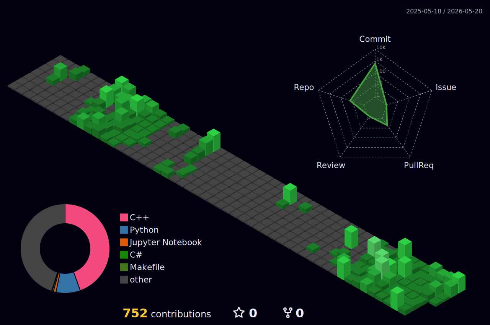

  

  

## 👋 About Me

물류 자동화 시스템을 개발하고 있는 엔지니어입니다.

## 🛠 Tech Stack

**DevOps & Infrastructure** 
  

**Language** 
   

**Database** 

**Robotics** 

**Tools & Collaboration** 
     

## 📌 Project Highlights

| 프로젝트                                                                                                  | 설명                                              |
| ----------------------------------------------------------------------------------------------------- | ----------------------------------------------- |
| [LiDAR-Reflection-Recovery](https://github.com/kyungddin/LiDAR-Reflection-Recovery-via-Shadow-Boxing) | ICTC 2025 논문 코드 — 거울 반사 왜곡 복원, GPU 병렬화로 3.2배 가속 |
| [Infra-LiDAR](https://github.com/kyungddin/Infra-LiDAR)                                               | 자율주행 종합설계 — UDP/CAN 통신, ROS 시뮬레이션               |
| [LGAimers6](https://github.com/kyungddin/LGAimers6)                                                   | 25만 건 임상 데이터 ML 분류 — ROC-AUC 7.5% 개선            |
