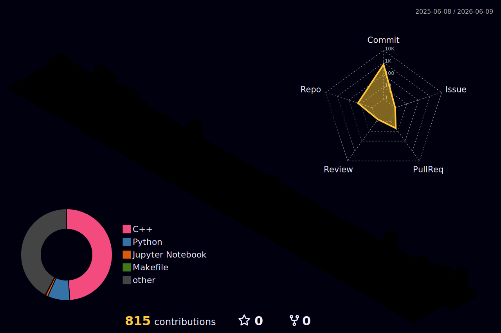

  

  <table>
    <tr>
      <td align="center">
        
      </td>
      <td align="center">
        
      </td>
    </tr>
  </table>

---

### 🚩 History
<small>

- 2019 ~ 2023 SeoulTech University MECH  
- 2019 ~ 2020 RnD Lab  
- 2020 ~ 2022 KOREA Air Force
- 2023 ~ 2026 Chung-Ang University EEE  
- 2025 ~ 2026 NSL Lab  

</small>

---

### 📄 Paper Publication
<small>

- The 16th International Conference on Information and Communication Technology Convergence (ICTC) - ICTC Workshop on Big Data, CPS, and 5G&6G Communication Networks (IWBCN)
  - LiDAR Reflection Recovery via Shadow Boxing
  - https://nsl.cau.ac.kr/papers/ictc/ictc2025-kim-lidar-mirror.pdf

</small>

---

### 🏆 Award
<small>

- IRC 2019 국가기술표준원장상  
  - https://www.irobotnews.com/news/articleView.html?idxno=18484

</small>

---

### ✨ Activity
<small>

- 2024 SK Hynix Semiconductor Curriculum
- 2025 LG Aimers 6th AI hackathon
- 2025 Hyundai H-Mobility Class
- 2025 LG Aimers 7th AI hackathon

</small>

---

### ⌨️ Programming Skill
<small>

- Language
  - C/C++
  - Python
  - Java
  - MATLAB
  - SystemVerilog
  - Assembly(ARM, MIPS)
- Devops
  - Docker
  - Ansible
- OS & Middleware
  - Linux
  - ROS
- Git/SVN
- MySQL/MariaDB

</small>

---

### 🧑‍💻 Programming Project
<small>

- 2019 Humanoid Robot Motion Control & Computer Vision  
- 2025 Decision Tree Ensemble Machine Learning Model for Binary Classification of Infertility Patients  
- 2025 X-Hyper320TKU Simulator Project
- 2025 LSTM Deep Learning Model for Food Service Menu Demand Forecasting
- 2025 LiDAR Reflection Recovery via Shadow Boxing
- 2025 Capstone Design : Infra LiDAR Based Autonomous Car System

</small>

---

### 🪫 Electronics Skill
<small>

- Vivado  
- Cadence Virtuoso  
- OrCAD/SPICE
- LiDAR Sensor  

</small>

---

### ⚡ Electronics Project
<small>

- 2024 SRAM Interface MAC ASIC Design
- 2025 3-bit Flash ADC Schematic & Layout Design

</small>

---

### 🗣️ English Skill
<small>

- 2022 TEPS 379  
- 2025 OPIC IH  

</small>
